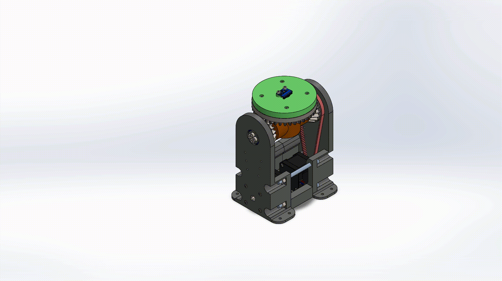

# IMU Calibration Test Stand with Differential Gear System

## Project Overview

This project presents the design and function of a **two-axis IMU calibration test stand**, developed to calibrate inertial measurement units (IMUs) such as the [MPU6050](https://invensense.tdk.com/products/motion-tracking/6-axis/mpu-6050/). The test stand enables controlled, repeatable motion for precise sensor calibration.

All mechanical parts are **3D printed**, and motion is driven by **NEMA 17 stepper motors** in combination with an **HTD timing belt system**. The movement is realized through a **differential gear mechanism**, providing two degrees of freedom (DoF).

---

## ⚙️ System Characteristics

- 🎯 **Purpose**: Accurate calibration of IMUs
- 🧩 **Mechanics**: Differential gear-driven motion
- 🧵 **Manufacturing**: Fully 3D printed components
- 🔄 **Degrees of Freedom**:  
  - **Z-axis**: Independently rotatable  
  - **X and Y axes**: Coupled motion, dependent on Z-axis rotation
- 🚀 **Actuation**: NEMA 17 stepper motors with HTD belt drive
- 🧠 **Controller**: Arduino Nano for motor control and signal processing

---

## 🖼️ Visualizations

### Z-Axis Rotation

  

### Exploded Assembly View

  

---

## 🧠 Motivation

Reliable IMU data is only possible when the sensors are properly **calibrated**. This test stand allows for controlled motion sequences, helping to identify and compensate for common issues such as drift, offset, and axis misalignment.

---

## 📌 Future Work

- Implement calibration software for bias and scale factor correction
- Enable automated test sequences via PC interface (e.g., Python or MATLAB)
- Add absolute position feedback (e.g., using encoders)

---

## 👨‍🔧 Author

- Anh Le Xuan – Student Assistant (SHK), responsible for mechanical design and implementation  
- Benjamin Waschilewski – Research Associate and Supervisor  
- Institute of Textile Machinery and High Performance Material Technology (ITM), TU Dresden