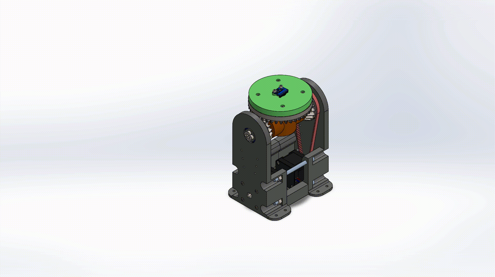
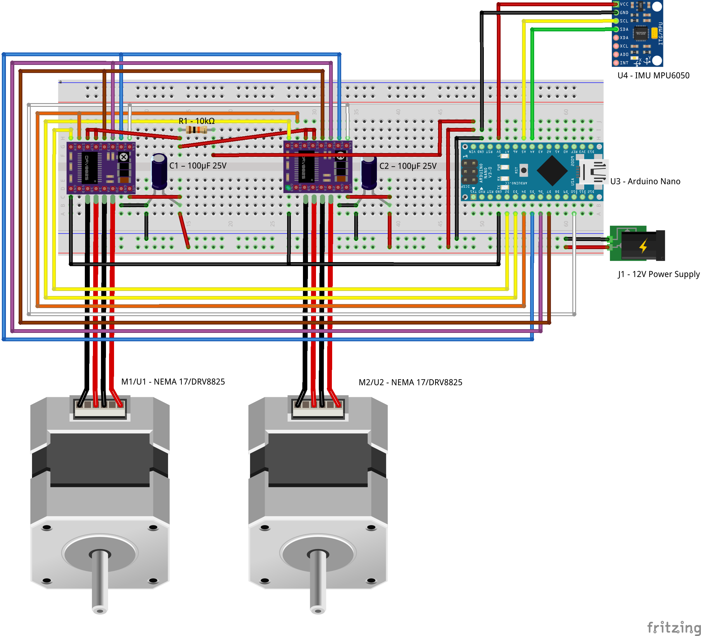
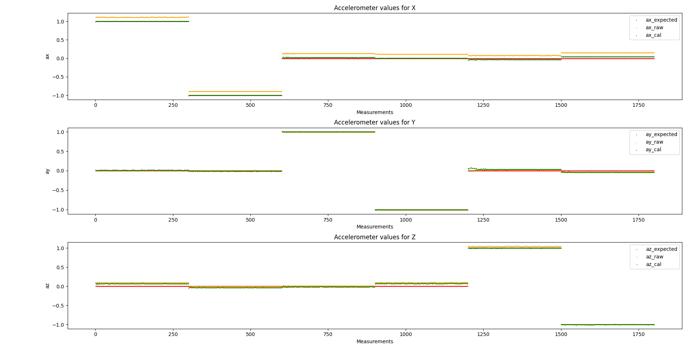
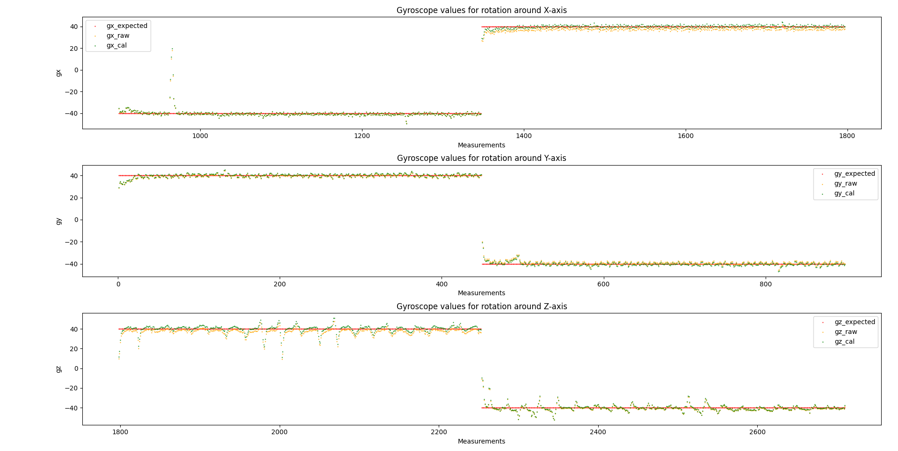

# IMU Calibration Test Stand with Differential Gear System

## Project Overview

This project presents the design and function of a **two-axis IMU calibration test stand**, developed to calibrate inertial measurement units (IMUs) such as the [MPU6050](https://invensense.tdk.com/products/motion-tracking/6-axis/mpu-6050/). The test stand enables controlled, repeatable motion for precise sensor calibration.

All mechanical parts are **3D printed**, and motion is driven by **NEMA 17 stepper motors** in combination with an **HTD timing belt system**. The movement is realized through a **differential gear mechanism**, providing two degrees of freedom (DoF).

---

## ⚙️ System Characteristics

- 🎯 **Purpose**: Accurate calibration of IMUs
- 🧩 **Mechanics**: Differential gear-driven motion
- 🖨️ Manufacturing: Fully 3D printed components
- 🔄 **Degrees of Freedom**:  
  - **Z-axis**: Independently rotatable  
  - **X and Y axes**: Coupled motion, dependent on Z-axis rotation
- 🚀 **Actuation**: NEMA 17 stepper motors with HTD belt drive
- 🧠 **Controller**: Arduino Nano for motor control and signal processing

---

## 🖼️ Visualizations

<b>Z-Axis Rotation</b> &nbsp;&nbsp;&nbsp;&nbsp;&nbsp;&nbsp;&nbsp;&nbsp;&nbsp;&nbsp;&nbsp;&nbsp;&nbsp;&nbsp;&nbsp;&nbsp;&nbsp;&nbsp;&nbsp;&nbsp;&nbsp;&nbsp;&nbsp;&nbsp;&nbsp;&nbsp;&nbsp;&nbsp;&nbsp;&nbsp;&nbsp;&nbsp;&nbsp;&nbsp;&nbsp;&nbsp;&nbsp;&nbsp;&nbsp;&nbsp;&nbsp;&nbsp;&nbsp;&nbsp;&nbsp;&nbsp;&nbsp;&nbsp;&nbsp;&nbsp;&nbsp;&nbsp;&nbsp;&nbsp;&nbsp;&nbsp;&nbsp;&nbsp;&nbsp;&nbsp;&nbsp;&nbsp;&nbsp;&nbsp;&nbsp;&nbsp;&nbsp;&nbsp;&nbsp;&nbsp;&nbsp;&nbsp;&nbsp;&nbsp;&nbsp;&nbsp;&nbsp; <b>X/Y-Axis Rotation</b> 
 

<b>Exploded Assembly View</b> 

---

## 🛠️ Calibration in Real Life (HAS TO BE ADDED!!!)

  

This animation demonstrates the real-life calibration process, where the IMU undergoes controlled multi-axis rotations.  
It shows how the test stand executes repeatable motion sequences to allow for accurate sensor calibration.

---
## Wiring Diagram

  

The wiring diagram shows the connection between the Arduino Nano, stepper motor drivers (A4988/DRV8825), NEMA 17 stepper motors, the MPU6050 sensor, and power supply.

---

## 📊 Sensor Data Visualization

To validate the calibration process, both **accelerometer** and **gyroscope** signals were recorded before and after calibration.  
The plots show the comparison between **raw data**, **calibrated data**, and the **expected values** during controlled rotations.  

### 📈 Accelerometer Calibration

  

The accelerometer plots illustrate the three axes (**ax, ay, az**).  
- 🟠 *Raw data* (uncalibrated)  
- 🟢 *Calibrated data* (after bias and scale factor correction)  
- 🔴 *Expected values* (reference for controlled rotation)  

Calibration significantly reduces **bias** and aligns the output closer to the expected reference.  

---

### 📈 Gyroscope Calibration

  

The gyroscope plots illustrate the three axes (**gx, gy, gz**).  
- 🟠 *Raw data* (uncalibrated)  
- 🟢 *Calibrated data* (after correction)  
- 🔴 *Expected values* (reference for applied rotation)  

Calibration minimizes **offset drift** and ensures a more accurate representation of angular velocity.  

---

✅ These visualizations confirm that the test stand enables **reliable calibration** by applying repeatable motion sequences and comparing sensor output to ground truth.

## 🧠 Motivation

Reliable IMU data is only possible when the sensors are properly **calibrated**. This test stand allows for controlled motion sequences, helping to identify and compensate for common issues such as drift, offset, and axis misalignment.

---

## 🚀 Project Status & Outlook

✅ The hardware and mechanics of the calibration test stand are complete.
🔜 Future work will focus on:

- 📈 Further data processing
- 💻 Graphical user interface (GUI) for easy operation

---

## 👨‍🔧 Author

- Anh Le Xuan – Student Assistant (SHK), responsible for mechanical design and implementation  
- Benjamin Waschilewski – Research Associate and Supervisor  
- Institute of Textile Machinery and High Performance Material Technology (ITM), TU Dresden